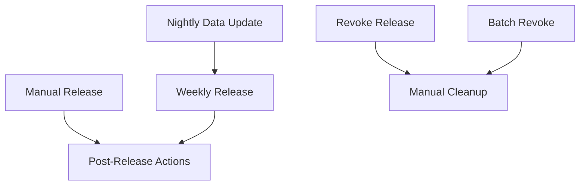

# GitHub Actions Workflows

This document explains the automated workflows that maintain and release the AWS Metadata package.

## Workflow Overview

The project uses a multi-stage approach to ensure data freshness while maintaining stable releases:

```
Daily: Nightly Data Update → Weekly: Release Creation → As Needed: Manual Actions
```

## Automated Workflows

### 🌙 Nightly Data Update
**File:** `.github/workflows/nightly-update.yml`  
**Schedule:** Daily at 00:00 UTC  
**Purpose:** Keep AWS data current

**What it does:**
1. Runs the data generation command
2. Commits any changes to AWS data files
3. Pushes updates to the main branch
4. **Does NOT create releases or tags**

**Files updated:**
- `pkg/data/manifests/*.json` - AWS data files
- `go.mod` / `go.sum` - If dependencies change

### 📦 Weekly Release
**File:** `.github/workflows/weekly-release.yml`  
**Schedule:** Sundays at 02:00 UTC  
**Purpose:** Create stable Go module releases

**What it does:**
1. Checks for commits since the last release
2. If changes exist, creates a new minor version
3. Generates changelog from commit history
4. Creates Git tag and GitHub release using GoReleaser
5. Publishes Go module to proxy

**Version strategy:**
- Increments minor version (e.g., v1.2.0 → v1.3.0)
- Only releases if there are actual changes
- Can be forced manually if needed

## Manual Workflows

### 🎯 Manual Release
**File:** `.github/workflows/manual-release.yml`  
**Trigger:** Manual via GitHub UI  
**Purpose:** Create releases on-demand with version control

**Options:**
- **Version type:** patch, minor, or major
- **Prerelease:** Mark as prerelease if needed

**Use cases:**
- Hotfix releases (patch versions)
- Feature releases (minor versions)
- Breaking changes (major versions)
- Emergency releases

### 🚫 Revoke Release
**File:** `.github/workflows/revoke-release.yml`  
**Trigger:** Manual via GitHub UI  
**Purpose:** Remove problematic releases

**What it does:**
1. Deletes the Git tag from repository
2. Deletes the GitHub release
3. Checks Go module proxy status
4. Provides guidance on Go proxy caching

**Safety features:**
- Requires typing "CONFIRM" to proceed
- Validates version tag format
- Checks if tag/release exists before deletion

### 📦 Batch Revoke Releases
**File:** `.github/workflows/batch-revoke-releases.yml`  
**Trigger:** Manual via GitHub UI  
**Purpose:** Remove multiple releases at once

**Features:**
- Comma-separated list of versions
- Dry run mode to preview actions
- Batch analysis and reporting
- Same safety features as single revocation

### 📋 Post-Release Actions
**File:** `.github/workflows/post-release.yml`  
**Trigger:** Automatic on release publication  
**Purpose:** Update documentation and verify Go module

**What it does:**
1. Updates README with latest version
2. Updates documentation with version references
3. Verifies Go module proxy availability
4. Provides release announcement information

## Workflow Dependencies



## Data Flow

### Daily Cycle
```
00:00 UTC: Nightly Update runs
    ↓
Checks AWS for new data
    ↓
Commits changes to main branch
    ↓
Data is fresh for development
```

### Weekly Cycle
```
Sunday 02:00 UTC: Weekly Release runs
    ↓
Checks for commits since last release
    ↓
Creates new version tag (if changes exist)
    ↓
GoReleaser creates GitHub release
    ↓
Go module becomes available
    ↓
Post-release actions update docs
```

## Version Strategy

### Automated Releases (Weekly)
- **Minor version bumps:** v1.2.0 → v1.3.0
- **Rationale:** Regular data updates are feature additions
- **Frequency:** Weekly (if changes exist)

### Manual Releases
- **Patch:** v1.2.0 → v1.2.1 (bug fixes)
- **Minor:** v1.2.0 → v1.3.0 (new features)
- **Major:** v1.2.0 → v2.0.0 (breaking changes)

## Monitoring

### Workflow Status
Check workflow status in the GitHub Actions tab:
- 🟢 **Success:** All steps completed
- 🟡 **Skipped:** No changes detected (normal for nightly)
- 🔴 **Failed:** Check logs for issues

### Common Scenarios

**Nightly Update Results:**
- ✅ "Changes detected" → AWS data was updated
- ℹ️ "No changes detected" → AWS data is current

**Weekly Release Results:**
- ✅ "Release created" → New version available
- ℹ️ "No changes since last release" → No release needed

## Troubleshooting

### Nightly Update Fails
1. Check AWS API access
2. Verify generate command works locally
3. Check for merge conflicts

### Weekly Release Fails
1. Check GoReleaser configuration
2. Verify git tags are valid
3. Check GitHub token permissions

### Go Module Not Available
1. Wait 5-10 minutes for proxy indexing
2. Check if tag was created successfully
3. Verify module name in go.mod

## Configuration Files

- **`.goreleaser.yaml`** - GoReleaser configuration
- **`.github/workflows/*.yml`** - All workflow definitions
- **`docs/release-revocation.md`** - Detailed revocation guide

## Best Practices

1. **Let automation work:** Don't manually create releases unless needed
2. **Monitor nightly updates:** Ensure data stays current
3. **Use manual releases sparingly:** For hotfixes or urgent features
4. **Document revocations:** Always provide clear reasons
5. **Test before manual releases:** Run tests locally first